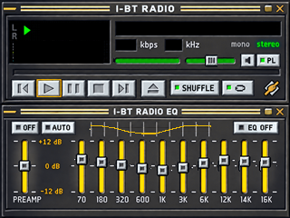
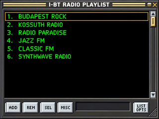

# I-BT-Radio — skins, hardware and BETA installer

**Magyar:** [README.md](README.md)

> **BETA — testing only.** Limited functionality; not recommended for integration, daily use, or unattended playback.

## Test the firmware

[V159 one-click installer package](beta/V159_HTTPS_STREAM/I-BT-Radio_V159_HTTPS_STREAM_BETA.zip) · [SHA-256](beta/V159_HTTPS_STREAM/I-BT-Radio_V159_HTTPS_STREAM_BETA.zip.sha256) · [test notes and current status](beta/V159_HTTPS_STREAM/README.en.md) · [source package](beta/V159_HTTPS_STREAM/V159_SOURCE_GPL3.zip)

The installer writes the application only and keeps the existing 16 MB flash layout. Firmware upload requires Python 3.9+; the serial menu test uses PowerShell and does not need Python. The source archive includes the V157 source snapshot, GPL-3.0 license and V159 HTTPS patch; the V159 target build is not yet independently reproducible from that archive.

**Known status:** V159 installed and booted, and the radio played through the DAC. The menu self-test immediately returned `start=DENIED` and completed zero menu steps, so it has not passed. HTTPS playback is unverified. TLS encrypts traffic, but this build does not validate the server certificate.

## Skins

The interface is **Winamp-inspired**, with I-BT RADIO branding and original drawn graphics. The original lightning marks have been removed.

The EQ curve is visual only; Bluetooth audio has no EQ processing. These images need a custom 320 × 240 TFT renderer and do not install themselves in stock yoRadio.

## Hardware and wiring

This wiring matches the ESP32 Small/Yellow Board V156 configuration. Check the labels and supply voltage on the actual board and modules before soldering.

This diagram shows the WROOM-32 module pins; the next image shows the Yellow Board connector labels.

**Required modification:** remove the onboard RGB LED before using GPIO4, GPIO16 or GPIO17 for the rotary switch, PSRAM and DAC. I have removed it from my radio. I do not use the built-in amplifier. Its input is connected to GPIO26 on this board family; check for electrical loading on the actual board before connecting rotary CLK there.

### PCM5102A DAC

| ESP32 | PCM5102A | Function |
|---|---|---|
| GPIO22 | BCK / BCLK | I²S bit clock |
| GPIO17 | DIN / DATA | I²S audio data |
| GPIO27 | LCK / LRCK / WSEL | word clock |
| GND | GND | common ground |
| verified module supply | VIN | module power |
| unconnected | SCK / MCLK | no external master clock on this firmware path |

The DAC output is line level and cannot drive a passive speaker. Check the exact module’s VIN rating.

### HW-040 rotary

| ESP32 | Rotary | Function |
|---|---|---|
| GPIO26 | CLK / A | encoder A |
| GPIO35 | DT / B | encoder B |
| GPIO4 | SW | push switch |
| 3.3 V | + / VCC | supply, if required |
| GND | GND | common ground |

GPIO35 has no internal pull-up. If the module has none, add a 10 kΩ resistor from DT/GPIO35 to 3.3 V. Never apply 5 V to an ESP32 GPIO.

### ESP-PSRAM64H — 64 Mbit / 8 MB, SOP-8-150 mil, 3.3 V

The package marking is `ESP PSRAM64H`; the exact Espressif part number is **ESP-PSRAM64H**, 64 Mbit (8 MB), SOP-8-150 mil, 3.3 V. Pin 1 is marked on the package. This wiring is only for this part.

| SOP-8 pin | Signal | Connection |
|---:|---|---|
| 1 | CE# / CS# | GPIO16; 10 kΩ pull-up to 3.3 V |
| 2 | SO / SIO1 | GPIO7 / shared flash SD_DATA0 |
| 3 | SIO2 | GPIO10 / shared flash SD_DATA3 |
| 4 | VSS | GND |
| 5 | SI / SIO0 | GPIO8 / shared flash SD_DATA1 |
| 6 | SCLK | GPIO6 / shared flash clock |
| 7 | SIO3 | GPIO9 / shared flash SD_DATA2 |
| 8 | VCC | 3.3 V |

Keep PSRAM CS separate from flash CS. GPIO6–10 are shared flash/PSRAM bus signals, not free GPIOs. The classic ESP32 maps at most 4 MB of an 8 MB chip in its conventional address range; the rest needs separate HiMem handling.

| PSRAM type | Capacity | Supply |
|---|---:|---:|
| ESP-PSRAM32 | 4 MB | 1.8 V |
| ESP-PSRAM32H | 4 MB | 3.3 V |
| ESP-PSRAM64 | 8 MB | 1.8 V |
| ESP-PSRAM64H | 8 MB | 3.3 V |

**Replacement options:** for 8 MB, use `ESP-PSRAM64H` or `LY68L6400SLI(T)` (64 Mbit, 3.3 V, SOP-8-150 mil). For a 4 MB downgrade, use `ESP-PSRAM32H`. ESP-IDF 5.5.5 lists LY68L6400 as a supported ESP32 PSRAM type. The non-H 1.8 V parts are not drop-in replacements for this 3.3 V board. Match the package and verify the chip marking before purchase. [Lyontek datasheet](https://www.lyontek.com.tw/pdf/ddr/LY68L6400-1.2.pdf) · [ESP-IDF 5.5.5 support](https://github.com/espressif/esp-idf/blob/v5.5.5/components/esp_psram/esp32/Kconfig.spiram).

### Other occupied pins

| Function | GPIOs |
|---|---|
| TFT | CS15, DC2, SCK14, MISO12, MOSI13, backlight21 |
| Touch | SCK25, MISO39, MOSI32, CS33, IRQ36 |
| SD card | SCK18, MISO19, MOSI23, CS5 |
| Light sensor | GPIO34 |

No IR receiver GPIO is assigned in the current firmware.

### Menu status

Green indicates positive operating feedback; red indicates disabled, faulty or not fully tested functions. This map is not a stability certification. See the [detailed hardware guide](hardware/README.md) for the original ESP32-WROOM-32 pinout and board-revision notes.
