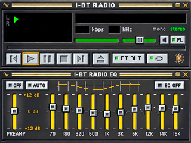
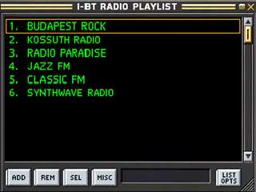
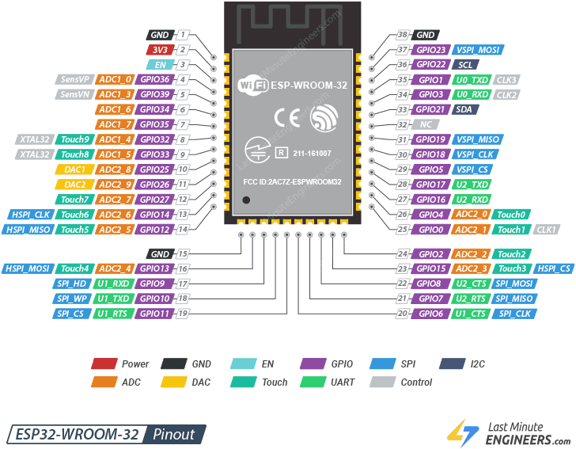
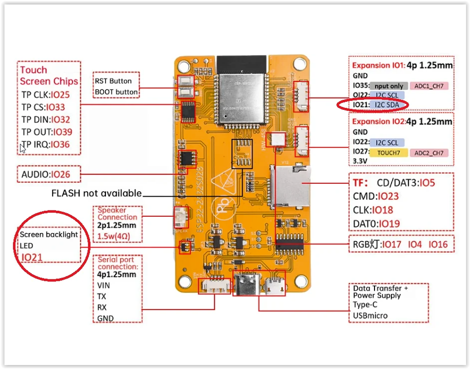
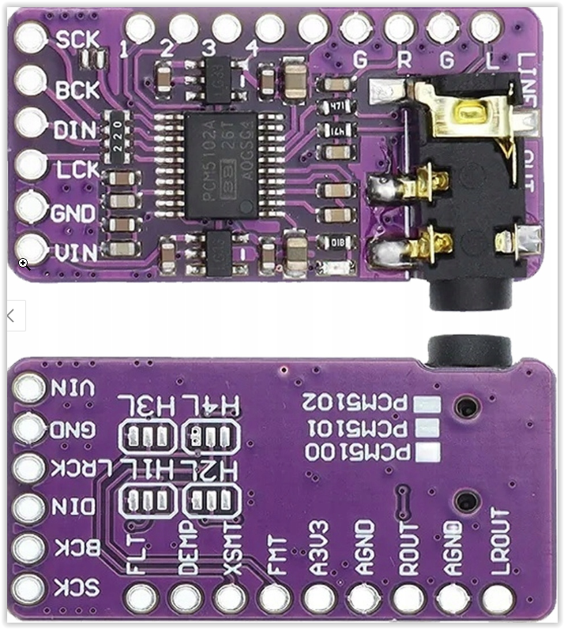
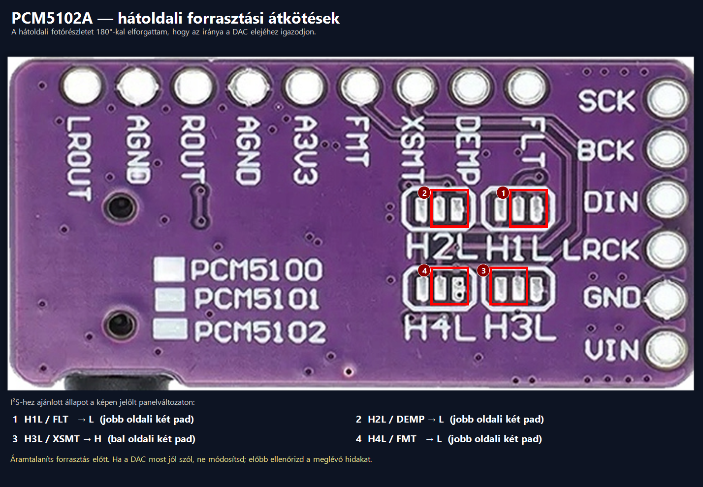
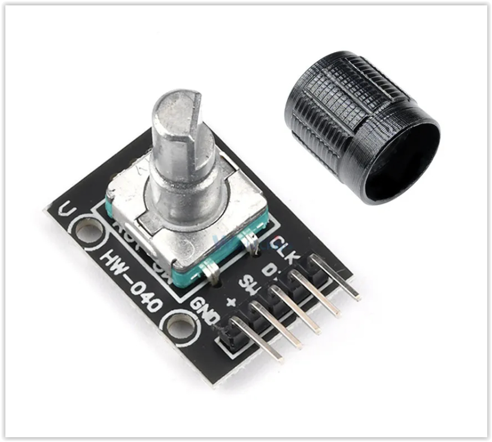
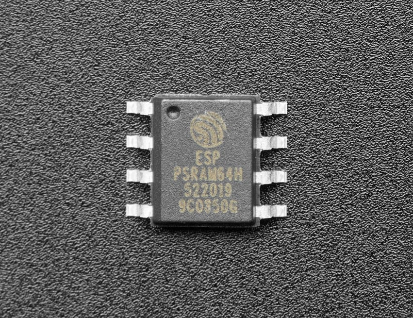
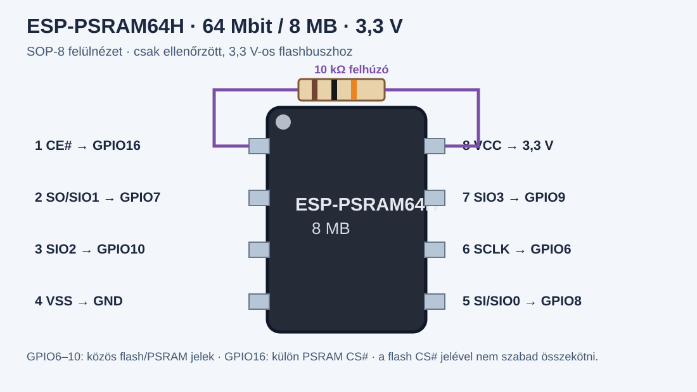
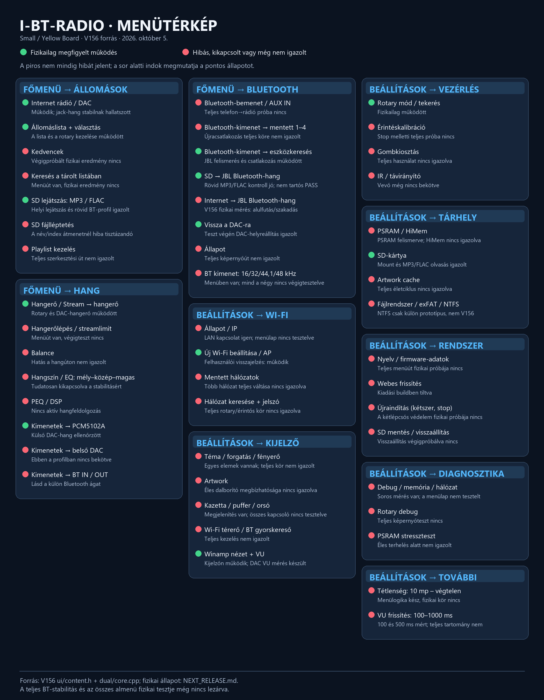

# I-BT-Radio — skinek, hardver és BETA telepítő

**English:** [README.en.md](README.en.md) · **Deutsch:** [README.de.md](README.de.md)

> **BETA — csak tesztelésre.** Korlátozottan működőképes; beépítésre, mindennapos vagy felügyelet nélküli használatra nem ajánlott.

## BETA firmware tesztelése

[V159 one-click telepítőcsomag](beta/V159_HTTPS_STREAM/I-BT-Radio_V159_HTTPS_STREAM_BETA.zip) · [SHA-256](beta/V159_HTTPS_STREAM/I-BT-Radio_V159_HTTPS_STREAM_BETA.zip.sha256) · [tesztleírás és aktuális állapot](beta/V159_HTTPS_STREAM/README.md) · [forrásanyagok, licenc és V159 patch](beta/V159_HTTPS_STREAM/V159_SOURCE_GPL3.zip)

A telepítő csak az alkalmazást írja a meglévő 16 MB-os flash kiosztásra. A firmware feltöltéséhez Python 3.9+ kell; a soros menüteszt PowerShellt használ, Python nélkül.

**Ismert állapot:** a V159 telepítése és indulása sikerült, a rádió DAC-kimeneten szólt. A menü-önteszt induláskor azonnal `start=DENIED` választ adott, 0 menülépéssel; ez nem menüteszt-PASS. A HTTPS-lejátszást még nem igazoltuk. A TLS titkosít, de a szerver tanúsítványát a jelenlegi kliens nem ellenőrzi.

A projekt a yoRadio GPL-3.0 licencű forrására épül. A forráscsomag a V157 forrásalapot, a licencet és a V159 HTTPS-módosítás patchét tartalmazza; önálló, reprodukálható V159 buildet még nem igazoltunk. A telepítő nem tartalmaz rádióról visszaküldött COM-naplókat vagy személyes hangfájlokat. Hibajelzés előtt távolítsd el a naplókból a Wi-Fi-adatokat és más személyes információkat.

Skinverzió: **0.1.3-preview** · [Változások](CHANGELOG.md). Saját I-BT RADIO grafika, egyedi feliratokkal és kezelőelemekkel. Ez grafikai előnézet; a Bluetooth-hang hosszú távú stabilitási próbája még folyamatban van.

## Skin előnézetek

Lejátszó és EQ:

Lejátszási lista:

Kazettatest; az állomás neve és borítóképe működés közben kerül rá:

## További fájlok

- [Részletes Yellow Board hardverleírás](hardware/README.md): panelváltozatok, foglalt GPIO-k, PSRAM-típusok és beépítés előtti ellenőrzések.
- [English readme](README.en.md): angol nyelvű, önállóan követhető hardver- és bekötési útmutató.
- [Lejátszóskin](skins/classic-player-320x240/README.md): 320 × 240 lejátszó/EQ és lista képek, RGB565LE adatok, koordináták.
- [Kazettaskin](skins/cassette-320x213/README.md): 320 × 213-as kép, RGB565LE adat és érintési zónák.

## Hardver és bekötés

Az alábbi kiosztás az ESP32 Small/Yellow Board 320 × 240-es változatához és a V156 firmware GPIO-beállításaihoz készült. A memórialapka tokján `ESP PSRAM64H` olvasható; az Espressif pontos típusszáma **ESP-PSRAM64H**, 64 Mbit (8 MB), SOP-8-150 mil, 3,3 V.

Ez az ESP32-WROOM-32 modul lábkiosztása; a Yellow Board csatlakozóit a következő kép mutatja.

### Yellow Board

**Fontos módosítás:** a GPIO4, GPIO16 és GPIO17 használata előtt az alaplapi RGB LED-et el kell távolítani. A saját rádiómban ezt már elvégeztem. A beépített hang-erősítőt nem használom; a GPIO26-ra kötött erősítőbemenet esetleges elektromos terhelését a saját panelrevízión külön ellenőrizni kell.

### PCM5102A külső DAC

A hátoldali részlet 180°-kal el volt forgatva; helyes tájolásra fordítottam. I²S beállítás: **H1L=L, H2L=L, H3L=H, H4L=L**. A keretek a forrasztási átkötések helyét emelik ki. Ha a DAC most szól, ne forraszd át; előbb ellenőrizd a meglévő hidakat.

| ESP32 jel | PCM5102A felirat | Funkció |
|---|---|---|
| GPIO22 | BCK / BCLK | I²S bitóra |
| GPIO17 | DIN / DATA | I²S hangadat |
| GPIO27 | LCK / LRCK / WSEL | bal/jobb csatorna óra |
| GND | GND | közös föld |
| ellenőrzött táp | VIN | a konkrét modul jelölése szerint |
| nincs bekötve | SCK / MCLK | ezen a firmware-úton nincs külső master clock |

A DAC vonalszintű kimenetet ad; passzív hangszórót közvetlenül nem hajt. A `VIN` feszültségét a konkrét modulon ellenőrizd, mert a modulváltozatok eltérhetnek.

### HW-040 rotary

| ESP32 jel | Rotary felirat | Funkció |
|---|---|---|
| GPIO26 | CLK / A | forgás A |
| GPIO35 | DT / B | forgás B |
| GPIO4 | SW | nyomógomb |
| 3,3 V | + / VCC | táp, ha a modul igényli |
| GND | GND | közös föld |

GPIO35-ön nincs belső felhúzás. Ha a rotary modulon sincs, tegyél 10 kΩ ellenállást a DT/GPIO35 és 3,3 V közé. A GPIO-ra ne adj 5 V-ot.

### ESP-PSRAM64H — 64 Mbit / 8 MB, SOP-8-150 mil, 3,3 V

| PSRAM64H SOP-8 láb | Jel | Bekötés |
|---:|---|---|
| 1 | CE# / CS# | GPIO16; 10 kΩ felhúzó 3,3 V-ra |
| 2 | SO / SIO1 | GPIO7 / flash SD_DATA0 |
| 3 | SIO2 | GPIO10 / flash SD_DATA3 |
| 4 | VSS | GND |
| 5 | SI / SIO0 | GPIO8 / flash SD_DATA1 |
| 6 | SCLK | GPIO6 / közös flashóra |
| 7 | SIO3 | GPIO9 / flash SD_DATA2 |
| 8 | VCC | 3,3 V |

Ez a rajz kizárólag 3,3 V-os **ESP-PSRAM64H** chiphez való. Az ESP-PSRAM64 1,8 V-os, ezért nem helyettesíthető vele. A PSRAM és flash közös GPIO6–10 buszjeleit ne használd általános GPIO-ként; a PSRAM külön CS jele GPIO16, a flash CS jelétől elkülönítve. A hagyományos ESP32 a 8 MB-ból legfeljebb 4 MB-ot képez le közvetlenül a szokásos címtartományba; a fennmaradó részhez külön HiMem-kezelés kell.

| PSRAM típus | Kapacitás | Tápfeszültség |
|---|---:|---:|
| ESP-PSRAM32 | 4 MB | 1,8 V |
| ESP-PSRAM32H | 4 MB | 3,3 V |
| ESP-PSRAM64 | 8 MB | 1,8 V |
| ESP-PSRAM64H | 8 MB | 3,3 V |

**Helyettesítő típusok:** azonos kapacitáshoz `ESP-PSRAM64H` vagy `LY68L6400SLI(T)` (64 Mbit, 3,3 V, SOP-8-150 mil); kisebb, 4 MB-os cseréhez `ESP-PSRAM32H`. A Lyontek chipet az ESP-IDF 5.5.5 külön támogatott típusként is felsorolja. A `H` nélküli 1,8 V-os változatok nem közvetlen cserék ezen a 3,3 V-os lapon. Beszerzéskor egyezzen a tokozás és ellenőrizd a feliratot. [Lyontek adatlap](https://www.lyontek.com.tw/pdf/ddr/LY68L6400-1.2.pdf) · [ESP-IDF 5.5.5 támogatás](https://github.com/espressif/esp-idf/blob/v5.5.5/components/esp_psram/esp32/Kconfig.spiram).

### További foglalt GPIO-k

| Funkció | GPIO |
|---|---|
| TFT | CS15, DC2, SCK14, MISO12, MOSI13, háttérfény21 |
| érintőpanel | SCK25, MISO39, MOSI32, CS33, IRQ36 |
| SD-kártya | SCK18, MISO19, MOSI23, CS5 |
| fényérzékelő | GPIO34 |

### Menürendszer állapottérképe

A zöld jelölés az adott funkcióval kapcsolatban rendelkezésre álló működési visszajelzést, a piros a kikapcsolt, hibás vagy még teljes fizikai tesztet igénylő részt jelöli. A térkép nem jelent teljes stabilitási igazolást. A GPIO-k, a PSRAM-részletek és a panelrevíziókra vonatkozó ellenőrzések a [részletes hardverleírásban](hardware/README.md) találhatók.

A lejátszó EQ-görbéje **csak látványelem**; Bluetooth módban nincs hangszínszabályzás. A képek egyedi 320 × 240-es TFT-megjelenítőben használhatók; önmagukban nem telepítik a kezelőfelületet a gyári [yoRadio](https://github.com/e2002/yoradio) rendszerbe. A yoRadio-hoz illesztőréteg külön készül.

Az I-BT-Radio a yoRadio alapjaira épül. Köszönet a yoRadio készítőinek.

## Támogatás

A támogatás önkéntes. A hozzájárulások ESP-k, mérőeszközök és fejlesztési kellékek vásárlására, valamint a projekt további fejlesztésére fordíthatók.
Ha teheted, segíts új ESP-panelek vásárlásában és a támogatott eszközök listájának bővítésében, köszönöm! :)

- **Ethereum (ETH):** `0xf044db3277a1b880713e81d66b6E507F65450EE6`
- **Bitcoin (BTC):** `3KLgXnbCs1WCD3igiVErxdy2CAH7QWchLs`
