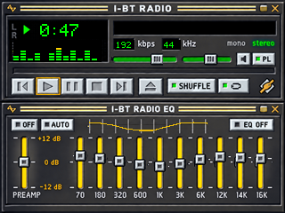

# Classic Winamp-inspired skin (320 × 240)

`player_eq.png` and `playlist.png` show the two static views. `*.rgb565le` contains the exact 16-bit pixels used by the I-BT-Radio V118 renderer, one little-endian RGB565 word per pixel, row-major, **without a header**. Each raw view uses 153,600 bytes of flash. `layout.json` lists the dynamic field and touch coordinates.

The following image shows **simulated** time, bitrate, sample rate, spectrum and volume for layout review. It is not a hardware-test photo:

The black wells intentionally have no baked-in time, station, bitrate or sample rate. A renderer must update them. The EQ curve and slider positions are a **visual ROCK-style preview**; the current audio EQ is off. The separate PLAY/PAUSE buttons and previous/next station actions are implemented in I-BT-Radio V118, but these image files alone do not add controls to stock yoRadio.

Stock yoRadio users can convert the raw data to a C header using `../../tools/rgb565le_to_header.py` and connect their display renderer to the coordinates in `layout.json`. A fully tested stock-yoRadio adapter is pending; these assets are usable for custom displays now.
